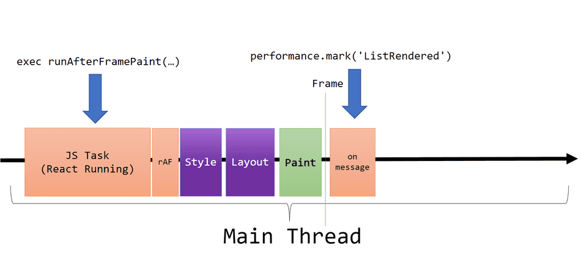

# react-callback-after-paint

### Introduction
Hi my name is Jean, I am a React developer, I encountered a bug re race-condition rendering, wherein two components render side by side, one referencing the other, but the latter could take a bit long to render depending on network conditions and main-thread load. 

I absolutely had to find away to run a sideEffect when my target (the latter) component has been painted on screen, I always thought a `useEffect` hook would run after a component was painted on the screen, but that it not quite the case, I discovered sometimes it does, sometimes it does not, I will include useful links that describe the problem in more detail. 

[Detecting when the Browser Paints Frames in JavaScript](https://webperf.tips/tip/measuring-paint-time/)
[Detecting when React Components are Visually Rendered as Pixels](https://webperf.tips/tip/react-hook-paint/)

---

### Credits
Big thank you to Joe Liccini, all credits go to Joe, I am publishing this package to help others, I may adapt and improve in future releases, you can see the original inspiration [https://webperf.tips/tip/react-hook-paint/](here), authored by Joe Liccini!.

### How this hook works
We can utilize the `requestAnimationFrame` and `MessageChannel APIs` to more accurately log when a DOM update is represented visually to the user.

To do this, we will use the following helper function `<root>/src/hooks/useCallbackAfterPaint`: 

    /**
    * Runs `callback` shortly after the next browser Frame is produced.
    */
    function runAfterFramePaint(callback) {
        requestAnimationFrame(() => {
            const messageChannel = new MessageChannel();

            messageChannel.port1.onmessage = callback;
            messageChannel.port2.postMessage(undefined);
        });
    }

> Note: In production code, we would need to adjust this callback to account for cases where the document.visibilityState is hidden and requestAnimationFrame won't fire. Production code would also need to handle cancellation if the React component is unmounted before this fires.

With our new helper setup, we can integrate it into a re-usable React Hook:

    function useMarkFramePaint({ markName, enabled }) {
        useEffect(() => {
            /**
            * Only perform the log when the calling component has signaled it is
            * ready to log a meaningful visual update.
            */
            if (!enabled) {
                return;
            }

            // Queues a requestAnimationFrame and onmessage
            runAfterFramePaint(() => {
                // Set a performance mark shortly after the frame has been produced.
                performance.mark(markName);
            });
        }, [markName, enabled])
    }

In your Component, we can use this hook like this:

    function MyComponent(props) {
        useMarkFramePaint({
            markName: 'MyComponentRendered',
            /**
            * Signal to the hook that we want to capture the frame right after our item list
            * model is populated.
            */
            enabled: !!props.items?.length
        });

        return (
            <ul>
                {
                    props.items?.map(item => (
                        <li key={item.id}>{item.text}</li>
                    ))
                }
            </ul>
        );
    }

With this hook integrated, we will queue a `performance.mark()` operation when `props.items` is populated. It will execute on the next frame produced after React JavaScript task completes:    

